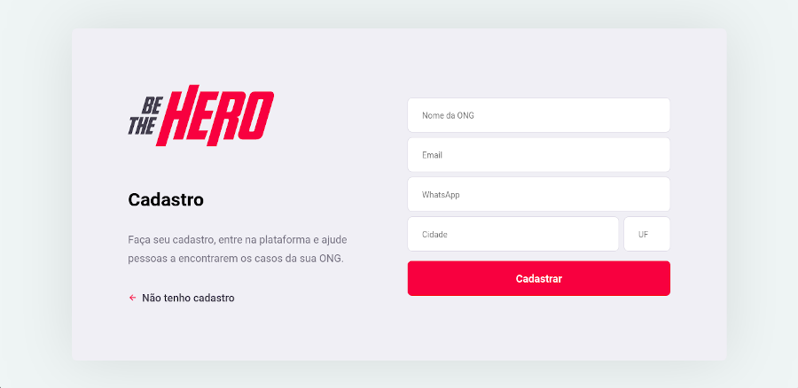
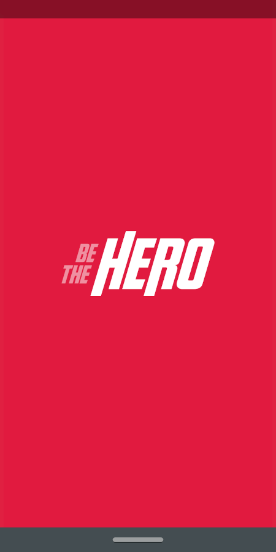

<h1 align="center">
    
</h1>

<h2 align="center"> Aplicação para conectar ONGs e outras instituições a pessoas que tem disponibilidade para ajudar </h2>

<h3 align="center"> Criada com a stack  React,  React Native,  Node e  SQLite </h3>

<p align="center">  </p>

<p align="center"> Usando a stack poderosa, que utiliza de uma única linguagem popular e moderna, o  JavaScript. <br> Produtividade e performance de forma enxuta. </p>

---

A 11ª edição da Semana OmniStack, ocorrida entre 23/03 e 27/03, trouxe como projeto uma aplicação web e mobile inédita. Um sistema para conectar pessoas dispostas a ajudar a ONGs que precisam dessa ajuda.

Em uma semana foi desenvolvida uma aplicação do zero, dominando o backend, frontend e o mobile com uma única linguagem e uma única biblioteca de interfaces.

[Layout](https://www.figma.com/file/2C2yvw7jsCOGmaNUDftX9n/Be-The-Hero---OmniStack-11?node-id=0%3A1) da aplicação no  Figma.

## Getting Started

### Prerequisites

[yarn](https://yarnpkg.com/)  
[expo](https://expo.io/learn)

### Installing

**Cloning the Repository**

```
$ git clone https://github.com/andrewmatheus/be-the-hero.git

$ cd be-the-hero
```

**Installing dependencies**

```
$ cd be-the-hero/backend
$ yarn

&&

$ cd be-the-hero/frontend
$ yarn

&&

$ cd be-the-hero/mobile
$ yarn
```

### Running

> Localhost
```
// backend
$ yarn dev

// frontend and mobile
$ yarn start
```
-------

**Acesse a versão web**: Acesse via **localhost:3000**.  

**Acesse a versão mobile**: Acesse via **localhost:19002**, leia o QR Code no seu celular e utilize o aplicativo  Expo para rodar a versão mobile no seu smartphone. Ou com algum emulador Android/iOS para rodar no seu computador.

--------

## Built With

- [Knex](http://knexjs.org/)
- [Cors](https://expressjs.com/en/resources/middleware/cors.html)
- [Express](https://expressjs.com/)
- [Jest](https://jestjs.io/)
- [Axios](https://github.com/axios/axios) - HTTP Client
- [ESlint](https://eslint.org/) - Linter
- [Prettier](https://prettier.io/) - Code Formatter
- [Babel](https://babeljs.io/) - JavaScript Compiler
- [Styled-Components](https://www.styled-components.com/) - Styles
- [React-Router-Dom](https://reacttraining.com/react-router/web/guides/quick-start) - Roteamento
- [React Icons](https://react-icons.netlify.app/) - Pacote de icons do React
- [ReactNavigation](https://reactnavigation.org/)


## Telas

<p align="center">
    
        
    
        
    
</p>

---

**&copy;  [Rocketseat](https://rocketseat.com.br/)**

**Instrutor: [Diego Fernandes](https://github.com/diego3g) | CTO Rocketseat**

## Contacts

Email: andrewmatheus@gmail.com

Connect with me at [LinkedIn](https://www.linkedin.com/in/andrew-cabral-developer/).

## License

This project is licensed under the MIT License - see the [LICENSE.md](https://github.com/andrewmatheus/gobaber11/blob/master/LICENSE) file for details
